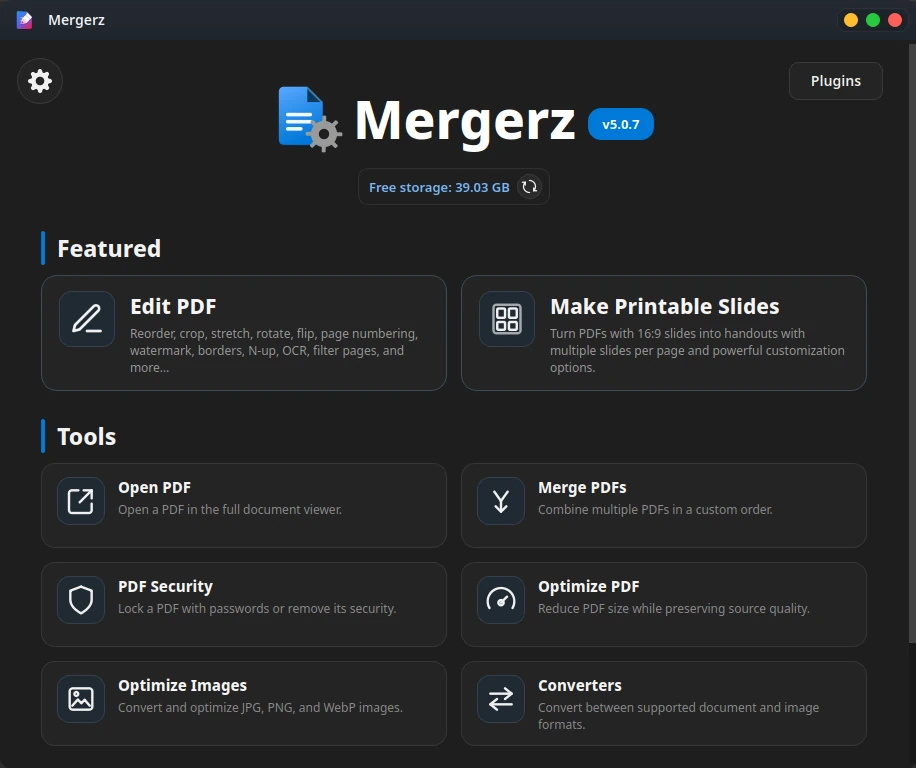

 

  

---

## Introduction

**Mergerz is a free, PDF-focused desktop utility for editing, organizing, transforming, optimizing, securing, converting, printing, and presenting documents—all from one fast, PDF-native workflow.** It combines a full visual PDF editor with page design, N-up layouts, OCR, image optimization, PDF/image conversion, PDF-to-DOCX, and document conversion tools, while preserving native text, vectors, and page content wherever possible.

The goal is simple:

> **Do more to your documents without unnecessarily destroying what is already inside them.**

Mergerz is built around a **PDF-native editing philosophy**. Operations such as invert, crop, rotate, flip, stretch, and other page transformations are performed directly on PDF pages and their underlying content whenever possible, rather than unnecessarily rasterizing the entire page.

This means less unnecessary bloat, faster processing, better scalability, and better preservation of vectors, text, and overall document quality.

---

# Installation

## Requirements

- Python 3.10 or newer
- PySide6-supported desktop platform

Optional functionality such as OCR, PDF-to-DOCX and LibreOffice conversion can be installed separately through Mergerz's plugin system.

## Install from PyPI

Install or upgrade Mergerz with:

`python -m pip install --upgrade mergerz`

Then launch:

`mergerz`

That is it.

---

# Why Choose Mergerz?

### Free to use

Mergerz is designed as a free desktop utility rather than a subscription-based document editor.

### PDF-native by design

The editor is built to avoid full-page rasterization for ordinary PDF editing operations. Text, vector artwork and page geometry can remain native instead of being flattened into a giant image.

### Full desktop application

No caller script. No terminal-driven menu. No manual script editing.

Install it and launch:

`mergerz`

### Huge feature set

Mergerz is no longer just a PDF merger. It now combines document editing, printing, optimization, conversion, OCR, security, page design, image processing and workflow automation in one application.

### Performance-focused

CPU-heavy tasks use background workers and multiprocessing where beneficial. Operations can use configurable worker counts, thresholds, temporary storage and memory policies.

### Strong cancellation and recovery

Long-running operations expose live progress and logs, with cancellation support where safe. Temporary work is staged separately and many save operations are verified before replacing or updating a destination.

### Smart memory handling

Processes like thumbnail rendering includes memory-safety logic and configurable memory policies to reduce the chance of exhausting RAM on large documents.

### Automatic application updates

Mergerz can quietly check PyPI after startup, notify you when a newer version exists, install the exact release and restart itself automatically.

### Modular plugin system

Heavy optional features are separated from the core installation. OCR, PDF-to-DOCX and LibreOffice functionality can be installed, updated or removed independently.

### Sleek dark UI

The application uses a custom dark desktop interface with custom window chrome, responsive layouts, modern dialogs, live previews and carefully designed workflow screens.

---

# Core Features

## 1. Full PDF Editor

The heart of Mergerz is its page-based PDF editor.

Open a PDF and work with its pages visually instead of managing command-line arguments.

### Page organization

- Thumbnail-based page grid
- Drag-and-drop page reordering
- Multi-selection
- Select all
- Deselect all
- Select arbitrary page ranges
- Page counters and selection statistics
- Page-by-page navigation
- Thumbnail zoom/density control
- Lazy/background thumbnail loading
- Thumbnail caching
- Reload support
- Undo / redo history
- Reset current edits
- Context menu actions
- Keyboard shortcuts throughout the editor

### Page operations

- Open as dummy page (allows to see editing results before saving)
- Cut pages
- Copy pages
- Paste pages
- Delete pages
- Crop pages
- Rotate 90° clockwise
- Rotate 90° counter-clockwise
- Flip horizontally
- Flip vertically
- Stretch pages to a custom aspect ratio
- Stretch pages to 16:9
- Apply PDF filters
- Apply page design
- Apply OCR
- Create N-up layouts
- Add other PDFs as pages
- Add images as pages
- Save selected pages separately
- Print selected pages
- Present selected pages

---

# 2. Advanced PDF Viewer

Mergerz includes a dedicated full document viewer rather than forcing every PDF workflow through the editor.

### Viewer features

- Smooth page viewing
- Zoom in/out
- Fit-to-width viewing
- Page navigation
- Page indicators
- Text selection
- Copy selected text
- In-document search
- Search next / previous
- Search result highlighting
- Bookmark sidebar
- Bookmark navigation
- External PDF link handling
- Context menu support
- Native printing
- Print-to-file support
- Presentation mode

---

# 3. Presentation Mode

Turn PDFs into a clean fullscreen presentation surface.

### Presentation features

- Fullscreen single-page presentation
- Previous/next page navigation
- Arrow-key navigation
- First page / last page shortcuts
- Fit-to-width
- Manual zoom
- Horizontal scrolling for wide pages
- Blank-screen mode
- Text selection while presenting
- Copy selected text
- Minimal chrome so the document remains the focus

Useful for:

- Teaching
- Lectures
- Presentations
- Demonstrations
- Fullscreen document viewing

---

# 4. Make Printable Slides

The original purpose of Mergerz is still here — but massively upgraded.

Turn lecture slides into compact printable pages.

### Slides-per-page modes

- 3 slides — Portrait
- 4 slides — Landscape
- 6 slides — Landscape

Note: use N-up in pdf editor for custom layout

### Printable-slide options

- Remove first slide
- Add new-PDF / new-lecture indicators
- Add PDF bookmarks
- Add page numbers
- Add slide borders
- Optimize the final PDF
- Invert colors
- Preserve images while inverting surrounding content
- Invert images only
- Leave everything unchanged

### Cover pages

Optional custom cover pages with:

- Title / chapter name
- Chapter number
- Subject
- Student name

Also supports:

- Front cover
- Back cover

### 16:9 handling

Slides are normalized to an absolute 16:9 display ratio during printable-slide generation.

This makes the N-up layout predictable and consistent.

---

# 5. Merge PDFs

Combine multiple PDFs into one document with a graphical workflow.

### Features

- Add multiple PDF files
- Reorder files manually
- Reorder by file name
- Clear the list
- View file/page statistics
- Merge into one PDF
- Add one bookmark per source PDF
- Automatically optimize the merged output

The final workflow is designed to be simple enough for everyday use while still providing control over the resulting document.

---

# 6. N-up / Merge Selected Pages

The PDF editor contains a dedicated N-up composition engine for turning selected pages into custom sheets.

### Page sizes

Built-in sizes include:

- A0 Portrait / Landscape
- A1 Portrait / Landscape
- A2 Portrait / Landscape
- A3 Portrait / Landscape
- A4 Portrait / Landscape
- A5 Portrait / Landscape
- A6 Portrait / Landscape
- Letter Portrait / Landscape
- Legal Portrait / Landscape
- Tabloid Portrait / Landscape
- Custom page size

### Grid control

- Custom columns
- Custom rows
- Large grid dimensions
- Automatic capacity calculation
- Page order direction

### Page sizing modes

- Equal-size cells
- Same page height
- Same page width
- Adaptive column widths
- Adaptive row heights
- Uniform scale

### Layout controls

- Consistent sizing across sheets
- Never enlarge pages
- Automatic 90° page rotation when beneficial
- Horizontal gaps
- Vertical gaps
- Top / bottom / left / right margins
- Page borders
- Border thickness
- Border color
- Page background color

### Preview

- Live sheet preview
- Multi-sheet navigation
- Zoom controls
- Exact output preview
- Dynamic layout recalculation

---

# 7. PDF Filters

Apply sophisticated visual adjustments to selected pages.

### Presets

- Custom
- Invert
- Invert without images
- Invert images only
- Grayscale

### Custom controls

- Layer color
- Layer opacity
- Blend mode
- Brightness
- Contrast
- Saturation
- Warmth
- Tint
- Grayscale
- Invert amount
- Gamma

### Blend modes

Supported modes include:

- Normal
- Multiply
- Screen
- Overlay
- Soft Light
- Hard Light
- Darken
- Lighten
- Color Dodge
- Color Burn
- Difference
- Exclusion
- Hue
- Saturation
- Color
- Luminosity

### Filter workflow

- Live preview
- Delayed exact preview
- Preview of the actual edited result
- Custom adjustment export
- Custom adjustment import
- Reset to defaults
- Apply filters to multiple pages at once

---

# 8. Crop Pages

A dedicated visual crop editor makes page cropping much easier than manually entering coordinates.

### Features

- Drag to define the crop area
- Resize from edges and corners
- Zoom controls
- Fit-to-page
- Page navigation
- Current page indicator
- Apply crop to one page
- Apply the same crop to multiple selected pages

---

# 9. Stretch Pages

Resize the visible page geometry to a desired aspect ratio.

### Features

- Custom aspect ratio
- Automatic ratio calculation
- Shared ratio across selected pages
- Live previews
- Exact output previews
- 16:9 workflows
- Preserve page content while changing visible geometry

Useful for:

- Lecture slides
- Mixed-orientation documents
- Standardizing imported pages
- Preparing documents for N-up layouts

---

# 10. Page Design

The Page Design system lets you build a reusable visual treatment directly onto PDF pages.

It contains three major tools.

## Page Numbering

- Enable/disable numbering
- Start numbering from a custom value
- Follow current editor page position
- Built-in application fonts
- Custom TTF/OTF fonts
- Custom font browsing
- Font size control
- Font color
- Exact X/Y positioning
- Drag-and-drop positioning
- Live preview
- Exact output preview
- Navigation across selected pages

## Borders

- Enable/disable border
- Solid
- Double
- Dashed
- Dotted
- Dash-dot
- Dash-dot-dot
- Long dash
- Thick
- Thin/thick
- Corner radius
- Thickness
- Opacity
- Color
- Individual edge selection
- Independent page-edge margins
- Front/behind-content layering

## Watermarks

### Text watermarks

- Custom text
- Custom font
- Custom font size
- Custom color
- Opacity
- Position
- Center or custom placement
- Inline text editing
- Live preview

### Image watermarks

- PNG
- JPG
- JPEG
- WebP
- Custom size
- Opacity
- Layering
- Custom position

### Watermark direction

- Left → right
- Top → bottom
- Right → left
- Bottom → top
- Diagonal directions

All Page Design components are incorporated into the PDF workflow rather than requiring full-page rasterization.

---

# 11. OCR

Mergerz includes an optional OCR plugin for turning scanned pages into searchable/selectable documents.

### OCR controls

- Automatic language mode
- Explicit language selection
- Dynamically discovered language list
- OCR version selection
- Detection model selection
- Recognition model selection
- Render DPI
- Detector maximum-side control
- Configurable CPU worker count
- ONNX Runtime inference
- Optional GPU acceleration

The OCR system discovers available language/model capabilities from the installed OCR environment instead of hardcoding a fixed model list into the application.

### OCR isolation

PaddleOCR and its runtime are installed into a dedicated isolated plugin environment rather than being forced into the main Mergerz environment.

This keeps the base application lighter and makes OCR independently manageable.

---

# 12. PDF Optimization

Mergerz contains a dedicated PDF optimization engine built around structural and resource-level optimization.

## Lossless optimization

- Compress vector/content streams
- Generate/compress PDF object streams
- Deduplicate identical resources safely
- Remove unused resources
- Remove unreachable objects
- Remove unnecessary document metadata
- Remove removable page thumbnails
- Remove safely provable unused font glyph data
- Remove hyperlinks
- Remove bookmarks

Resource deduplication is deliberately conservative: resources are only merged when their rendering semantics can be safely considered equivalent.

## Optional image downsampling

- Detect displayed image placement size
- Calculate effective DPI
- Downsample images above the target DPI
- Avoid unsupported/unsafe image types
- Keep an image unchanged when a smaller representation is not beneficial
- Use configurable target DPI
- Include memory-safety checks
- Parallelize heavy image processing when appropriate

### Target DPI options

From low-resolution optimization through extremely high targets, including:

35, 72, 96, 120, 150, 200, 240, 300, 400, 600, 900, 1200, 1800 and 2400 DPI.

### Preservation targets

The optimizer is designed around preserving:

- Selectable text
- Unicode mappings
- Vector graphics
- Page content
- Annotations/comments
- Forms and interactive fields
- Page boxes
- Rotation
- Geometry
- Embedded files
- Catalog resources
- Attachments

Digitally signed PDFs and XFA forms are deliberately rejected by the optimizer instead of being rewritten in a way that could invalidate security or interactive behavior.

---

# 13. PDF Security

Protect and unlock PDFs through a dedicated security workflow.

### Lock PDF

- Separate viewing password
- Separate editing password
- Password confirmation
- Existing security detection
- Replacement of existing security where authorized
- AES-256 PDF encryption
- Output verification

### Unlock PDF

- Detect current security
- Accept authorized passwords
- Remove PDF encryption
- Remove password restrictions
- Verify that the resulting PDF is actually unlocked
- Preserve page count
- Keep the source untouched until the result is verified

---

# 14. Image Optimization

Mergerz includes a dedicated batch image optimizer.

### Supported formats

- JPG
- PNG
- WebP

### General controls

- Output folder selection
- Format conversion
- Resolution scaling from 1% to 100%
- Metadata keep/remove
- Advanced format-specific settings

## JPEG

- Quality control
- Optimize encoding
- Progressive JPEG
- Metadata preservation/removal
- Chroma subsampling:
  - Auto
  - 4:4:4
  - 4:2:2
  - 4:2:0

## WebP

- Lossy mode
- Lossless mode
- Quality control for lossy output
- Encoding method
- Metadata preservation/removal

## PNG

- Optimize encoding
- Compression level
- Metadata preservation/removal
- Interlacing:
  - None
  - Adam7
- Optional palette color reduction

A built-in format explanation dialog helps users understand the implications of the available image settings.

---

# 15. Save Selected Pages as Images

Selected PDF pages can be rendered into:

- JPG
- PNG
- WebP

with configurable output resolution.

WebP supports:

- Lossy
- Lossless

The image export pipeline can also account for the current page design, transformations and selected-page state.

---

# 16. PDF → Image

Convert PDF pages into image files.

### Features

- JPG
- PNG
- WebP
- WebP lossy/lossless
- Configurable DPI
- Arbitrary page ranges
- Custom output directory
- Open directly in the PDF editor for more advanced selection/editing

---

# 17. Image → PDF

Images can be added into a PDF through the existing editor/blank-canvas workflow.

### Image placement settings

Choose how new images should fit the PDF page:

- Fit to most common width
- Fit to most common height
- Fit to most common width and height
- Fit within custom width/height limits

Additional controls allow you to decide whether unused page area should be retained.

Images keep their proportions and are centered on the generated PDF page.

---

# 18. PDF → DOCX

PDF-to-DOCX conversion is available as an optional plugin.

The PDF2DOCX runtime is isolated from the main Mergerz installation.

### Plugin features

- Dedicated installation
- Dedicated update system
- Dedicated isolated environment
- Verification after installation/update
- Easy uninstall
- Version/status reporting

---

# 19. LibreOffice Converters

Mergerz can optionally install its own isolated LibreOffice runtime for document conversion.

The converter system provides:

- Dynamic format discovery
- Live runtime capability detection
- Source format selection
- Target format selection
- Platform-aware runtime management
- Isolated runtime storage
- Per-user runtime/profile/cache handling

This allows Mergerz to expose the formats supported by the installed LibreOffice runtime rather than maintaining a small hardcoded conversion list.

---

# 20. Plugin System

Heavy functionality is intentionally separated from the main application.

## Available plugin families

### OCR

Provides:

- PaddleOCR
- OCR model management
- ONNX Runtime
- Language discovery
- CPU OCR
- Optional GPU OCR

### PDF to DOCX

Provides:

- PDF2DOCX
- Isolated runtime
- Independent updates
- Independent uninstall

### LibreOffice Runtime

Provides:

- LibreOffice-based conversions
- Platform-specific runtime downloads
- Runtime verification
- Independent updates
- Runtime removal

### OCR GPU Acceleration

Optional NVIDIA/CUDA support can be added later without reinstalling the entire OCR environment.

---

# 21. Plugin Management

The Plugins page provides a complete management interface.

### Plugin operations

- Scan installed plugins
- View versions
- Inspect health/status
- Install plugins
- Update plugins
- Uninstall plugins
- Install GPU acceleration
- Remove GPU acceleration
- Check one plugin for updates
- Check all plugins for updates
- Select multiple plugin updates
- Batch-update selected plugins
- Open the plugin storage location

Heavy plugin operations use progress dialogs with live logs.

---

# 22. Automatic Mergerz Updates

The application itself can update directly from PyPI.

### Update workflow

- Mergerz launches normally first
- Background update check begins after startup
- Startup is not blocked by the network request
- Current installed package version is compared against PyPI
- No update = no persistent notification
- Offline/error = silently ignored
- New version = update notification appears at the bottom of the main menu
- User can dismiss the notification
- User can install the update directly from Mergerz
- Update uses the current Python environment
- Exact target version is installed
- Installed version is verified
- Mergerz shuts down cleanly
- The application automatically restarts using the installed launcher

No caller script is required.

---

# 23. Performance & Multiprocessing

Mergerz is designed for large documents rather than only tiny PDFs.

### Configurable multiprocessing

Separate multiprocessing settings are available for:

- Thumbnail generation
- Image generation
- PDF resource deduplication

Each subsystem can have its own worker count and threshold.

OCR also has its own configurable CPU-worker count.

### Smart workload selection

Depending on document size and workload, Mergerz can choose between:

- Single-process execution
- Multiprocessing
- Memory-backed processing
- Temporary-disk-backed processing

This avoids paying multiprocessing overhead for tiny tasks while still scaling larger workloads.

---

# 24. Memory Safety

Large PDFs can become RAM-heavy very quickly.

Mergerz includes memory-aware processing in several expensive workflows.

### Memory controls

- Auto memory mode
- Force memory mode
- Disable memory mode
- RAM safety estimation
- Image workload sampling
- Thumbnail safety checks
- Large-image safety checks
- Temporary-disk fallback where appropriate
- User-facing insufficient-memory dialogs

The goal is to keep large operations predictable instead of blindly allocating memory until the operating system starts suffering.

---

# 25. Temporary Workspace & Safe File Handling

Mergerz uses dedicated temporary workspaces for expensive operations.

### Safety features

- Temporary processing files
- Background temp cleanup
- Stale temporary file cleanup
- Unique output names
- Atomic file replacement
- Verification before final replacement
- Original-file preservation during failed operations
- Cleanup after cancellation
- Cleanup after application shutdown

Long-running workflows are designed so that a failed intermediate step does not automatically destroy the source document.

---

# 26. Progress, Logs & Cancellation

Long operations do not disappear into a frozen window.

Mergerz provides:

- Progress bars
- Indeterminate progress mode
- Live processing status
- Live logs
- Full log viewer
- Success/error/warning log levels
- Cancellation support
- Result summaries
- Output file actions
- Operation-specific dialogs

This is especially useful for:

- OCR
- PDF optimization
- N-up composition
- Thumbnail generation
- Image conversion
- PDF conversion
- Plugin installation
- Plugin updates
- Application updates

---

# 27. Persistent Settings

Mergerz remembers advanced application settings in `settings.json`.

### Persistent configuration includes

- Multiprocessing settings
- Worker counts
- Processing thresholds
- Thumbnail generation
- Thumbnail DPI
- Memory policy
- Image-to-PDF layout behavior
- OCR capability/cache information
- LibreOffice converter capability/cache information

The settings system includes validation, migration and repair logic so settings from earlier versions can be upgraded safely when the schema changes.

---

# 28. User Interface

The UI is designed as a desktop application rather than a collection of raw dialogs.

### UI characteristics

- Dark modern interface
- Custom window title bar
- Custom window buttons
- Responsive layouts
- Scrollable settings pages
- Live previews
- Compact toolbars
- Tooltips throughout the editor
- Keyboard shortcuts
- Dedicated modal workflows
- Independent Settings / Plugins / Workflow windows
- Visual status indicators
- Storage indicator
- Update notification footer
- Carefully designed warning and confirmation states

---

# 29. Free Storage Awareness

The main menu displays currently available storage and allows the value to be refreshed.

This is especially useful because PDF editing, rendering and optimization can temporarily require significant disk space.

---

# 30. Keyboard-Friendly Workflow

Mergerz includes a large set of keyboard shortcuts for common editing actions.

Examples include:

- `Ctrl+A` — Select all pages
- `Ctrl+O` — Multi-select
- `Ctrl+Shift+R` — Select page range
- `Ctrl+X` — Cut
- `Ctrl+C` — Copy
- `Ctrl+V` — Paste
- `Delete` — Delete selected pages
- `Ctrl+Z` — Undo
- `Ctrl+Y` — Redo
- `Ctrl+K` — Crop
- `Ctrl+Shift+T` — Stretch
- `Ctrl+Left` — Rotate 90° CCW
- `Ctrl+Right` — Rotate 90° CW
- `Ctrl+Shift+H` — Flip horizontally
- `Ctrl+Shift+V` — Flip vertically
- `Ctrl+Shift+P` — Page design
- `Ctrl+Shift+M` — N-up / Merge
- `Ctrl+Shift+I` — Apply filters
- `Ctrl+N` — Add PDF/Image as pages
- `Ctrl+P` — Print
- `Ctrl+Shift+S` — Save selected pages as
- `Ctrl+R` — Reload
- `F5` — Presentation mode

Many operations such as presentation mode also expose navigation-specific shortcuts inside their own dialogs.

---

# Design Philosophy

Mergerz is built around a few principles:

### 1. Don't rasterize what does not need to be rasterized.

A PDF already contains structured content.

Crop, rotation, flipping, stretch, page numbering, borders, watermarks and core filtering workflows are designed to operate on the document rather than turning the whole page into a screenshot first.

### 2. Heavy dependencies should be optional.

OCR, PDF2DOCX and LibreOffice are useful, but not every user needs them.

### 3. Large operations should be observable.

Show the user what is happening through progress, logs, status messages and result summaries.

### 4. Cancellation should be safe.

Do not abandon workers, child processes or temporary files just because the user pressed Cancel.

### 5. Never modify the source unnecessarily.

Use temporary output, verification and atomic replacement whenever practical.

### 6. Never ruin previous edits.

New edit operations are done on top of previous editing results, so that we can expected outputs.

### 6. Performance should scale with the workload.

Small tasks should stay lightweight.

Large workloads should be able to use multiprocessing, worker pools, caching and memory-aware strategies.

---

# Changelog

See the full release history:

https://github.com/AfnanTawsif/mergerz/releases

---

# Issues & Feature Requests

Bug reports, feature requests and technical feedback are welcome through GitHub Issues:

https://github.com/AfnanTawsif/mergerz/issues

---

# Contact

For questions, feedback or development-related contact:

- Facebook: https://www.facebook.com/not.tawsif
- Instagram: https://www.instagram.com/_hey_tawsif_/
- Telegram: https://t.me/KindaDeadNgl
- Email: acer.only2001@gmail.com

---

# License

**All Rights Reserved.**

Mergerz is free to use, but the source code, application, branding and associated assets are not released under the MIT License or another permissive open-source license.

Do not redistribute, relicense, modify for redistribution, or commercially repackage the project without permission from the author.

---

  <b>Mergerz</b> 
  A document workspace built to do more - while preserving more.

  © Afnan Tawsif - All Rights Reserved

